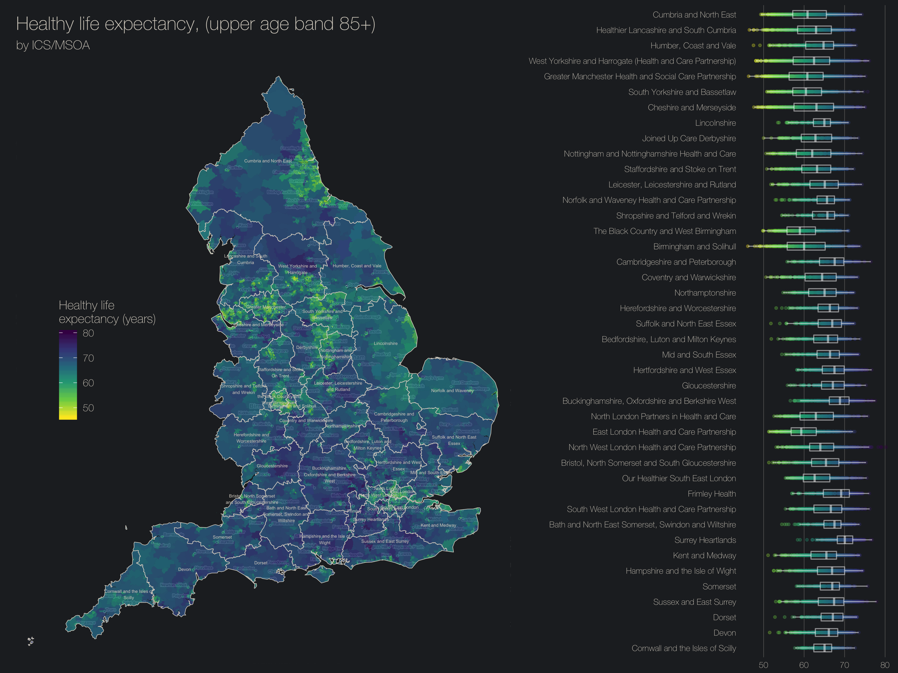

# Creating maps using Public Health Data and Maps in R
## Using fingertipsR and ONS geodata

This repository contains all the code needed to access maps using the fingertipsR package and maps from the ONS. It uses the R packages:
  - tidyverse
  - sf
  - ggmap
  - cowplot
  - fingertipsR
  
The full code can be viewed on github using the [report.md](report.md) file and a copy of the output with hi-res images can be seen by downloading [report.nb.html](report.nb.html). Please feel free to clone the reporsitory and get started. Please note some of the fonts used will not work automatically with Windows machines and so if using R on windows you may wich to change the `base_family` argument in `theme_dark()` to `theme_dark(base_family = 'sans')` to use the local sans-serif font.

## Final Image

