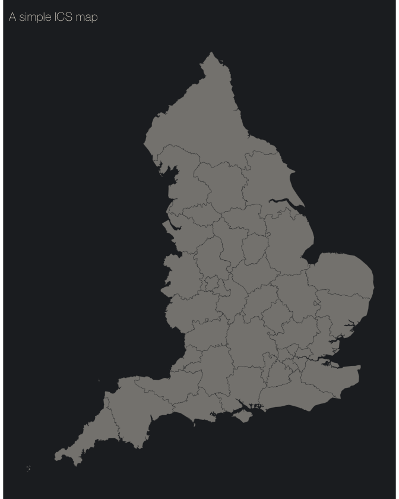
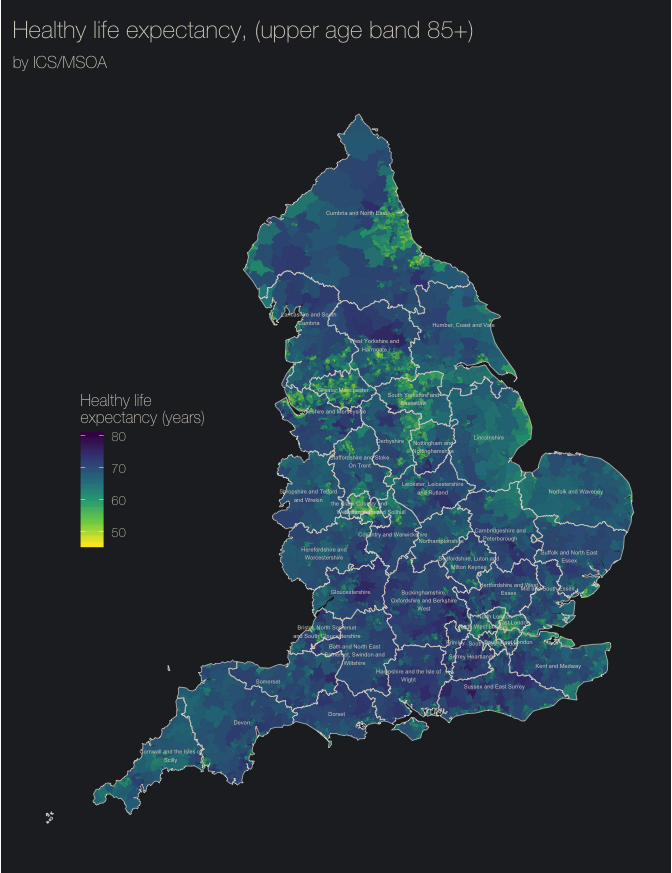
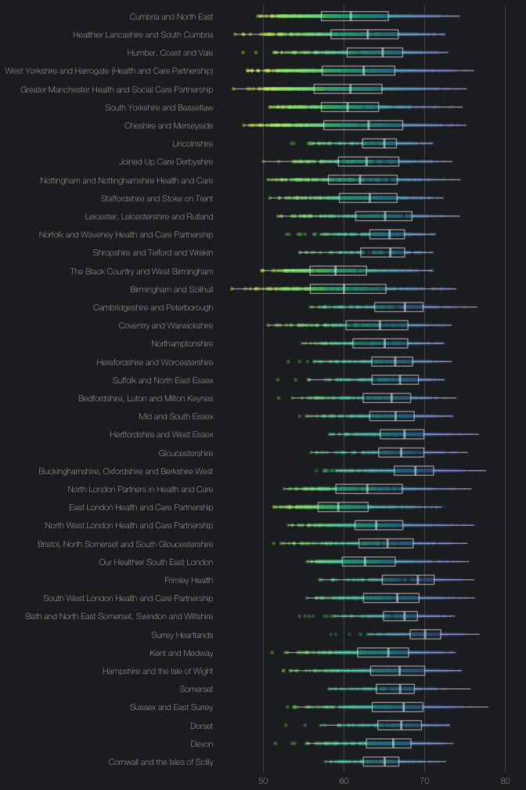
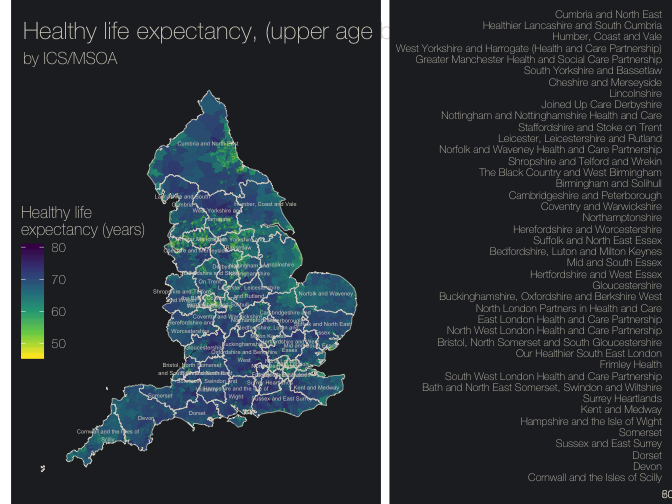
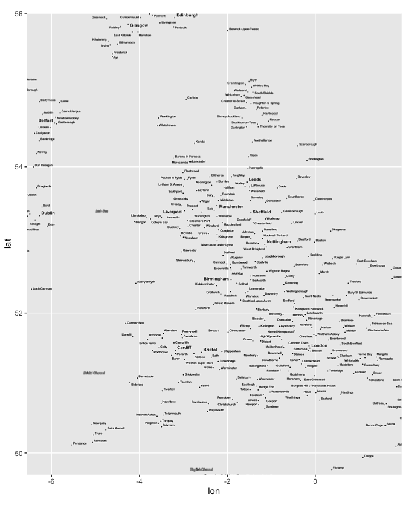
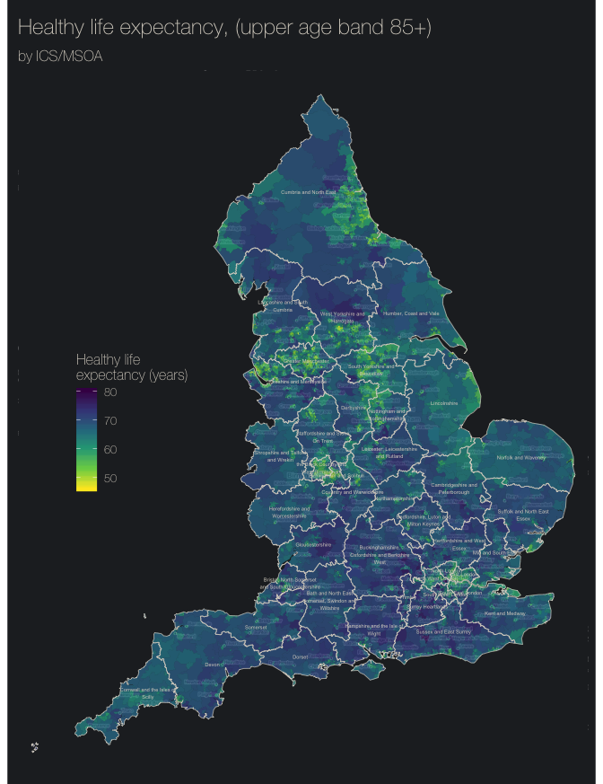
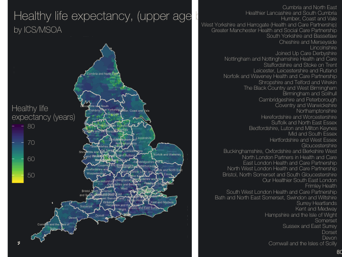

Mapping Health Outcomes for Integrated Care System
================

# Setup

``` r
# Load packages
pk <- c('tidyverse', 'sf', 'fingertipsR', 'ggmap', 'cowplot')
sapply(pk, function(x){
  if(!(x %in% installed.packages())){
    install.packages(x, character.only = TRUE)
  }
  require(x, character.only = TRUE)
})
```

    ##   tidyverse          sf fingertipsR       ggmap     cowplot 
    ##        TRUE        TRUE        TRUE        TRUE        TRUE

``` r
# run all the scripts in the 'etc' folder (this contains the script for creating themes)
list.files('etc', full.names = TRUE, pattern = '.r') %>%
  map(source)
```

    ## [[1]]
    ## [[1]]$value
    ## function (base_family = "Helvetica Neue Thin", base_size = 10) 
    ## {
    ##     theme_minimal(base_family = base_family, base_size = base_size) %+% 
    ##         theme(plot.background = element_rect(fill = colours[["dark"]], 
    ##             colour = "transparent"), panel.grid = element_blank(), 
    ##             plot.title = element_text(size = rel(1.5), margin = margin(10, 
    ##                 2, 10, 2)), text = element_text(colour = colours[["light"]]), 
    ##             axis.text = element_text(colour = colours[["light"]]))
    ## }
    ## 
    ## [[1]]$visible
    ## [1] FALSE

``` r
# create a folder to store the geojson files for making maps
# this saves downloading them every time
if(!dir.exists('map_json')){dir.create('map_json')}

# define a small function to check for a geojson file and download it if we don't have it locally yet
load_sf <- function(u, path, file){
  fp <- paste0(path, '/', file, '.geojson')
  if(!file.exists(fp)){
    download.file(url = u, destfile = fp)
  }
  read_sf(fp)
}

# (download if needed and ) load the ics geojson file as an sf object
ics <- 'https://opendata.arcgis.com/datasets/1a3b3e9f044a44a895d64000cddf9272_0.geojson' %>%
  load_sf(path = 'map_json', file = 'ics') %>%
  mutate(
    stp_name = 
      str_remove_all(string = str_to_lower(stp19nm),
                              pattern = 'health.*care.*|partners in|health[a-z]{0,3}|join.*care|our|\\(') %>%
      str_squish() %>%
      str_to_title() %>%
      str_replace_all(c('And'='and', 'The' = 'the', 'Of' = 'of'))
  )

# do the same with msoas
msoa <- 'https://opendata.arcgis.com/datasets/c661a8377e2647b0bae68c4911df868b_3.geojson' %>%
  load_sf(path = 'map_json', file = 'msoa')

# and one for england as a county
eng <- 'https://opendata.arcgis.com/datasets/629c303e07ee4ad09a4dfd0bfea499ec_0.geojson' %>%
  load_sf(path = 'map_json', file = 'countries') %>% 
  filter(ctry18nm == 'England')

# create an inverse of the england map (essentially a square with an england shaped hole!)
eng_punch <-
  eng %>%
  st_buffer(dist = .2) %>%
  st_bbox() %>% 
  st_make_grid(n = 1) %>% 
  st_difference(eng)
```

# Plotting ICSs

Let’s start by plotting a basic ICS map to get started.

``` r
# create the map
m <-
  ggplot(ics, aes(x = long, y = lat, label = str_wrap(stp19nm, 25), fill = st_areashape)) +
  geom_sf(size = .1, colour = colours[['dark']],  alpha = .5, fill = colours[['light']]) +
  scale_fill_viridis_c() +
  labs(
    title = 'A simple ICS map'
  ) +
  theme_dark() +
  theme(
    legend.position = c(.1, .5),
    axis.text = element_blank(),
    axis.title = element_blank()
  )

# create an output directory with a mps directory in it and save a copy of the image
if(!dir.exists('output/maps')){dir.create('output/maps', recursive = TRUE)}
ggsave(plot = m, path = 'output/maps', filename = 'simple_ics.png', height = 8, width = 8/1.25, bg = '#222629')

# display the image
m
```

<!-- -->

# Getting some data

Handily the [fingetipsR](https://github.com/ropensci/fingertipsR)
package from Public Health England has some great data at MSOA level
which works really nicely on maps to illustrate health inequalities.
Download a local copy of the file to save hammering the PHE servers\!
This will take a while the first time it’s run because it needs to fetch
data and write it locally but should speed up after the downloads from
PHE are done.

``` r
# create a directory to hold the raw data
if(!dir.exists('data')){dir.create('data')}

# if fingertips data hasn't been downloaded yet then download it and write it to data
if(!file.exists('data/fingertips_data.csv')){
  fingertipsR::indicators() %>%
  filter(str_detect(tolower(IndicatorName), 'healthy life exp|mortality')) %>%
  pluck('IndicatorID') %>%
  unique() %>%
  fingertips_data(AreaTypeID = 3) %>%
  write.csv('data/fingertips_data.csv', na = '')
}

# same for an lsoa to stp lookup table
if(!file.exists('data/lsoa_stp.csv')){
  'https://opendata.arcgis.com/datasets/520e9cd294c84dfaaf97cc91494237ac_0.csv' %>%
    download.file('data/lsoa_stp.csv', mode = 'w')
}

# get oa lookup and then for an oa to lsoa to msoa lookup
if(!file.exists('data/oa_lookup.csv')){
  'http://geoportal1-ons.opendata.arcgis.com/datasets/fe6c55f0924b4734adf1cf7104a0173e_0.csv' %>%
    download.file('data/oa_lookup.csv', mode = 'w')
}

# read the files and create a dataframe 'oa_lookup' with lsoa to msoa in it
data <- read_csv('data/fingertips_data.csv')
lsoa_stp <-read_csv('data/lsoa_stp.csv')
oa_lookup <-
  read_csv('data/oa_lookup.csv') %>%
  group_by(LSOA11CD, LSOA11NM, MSOA11CD, MSOA11NM) %>%
  summarise() %>%
  left_join(lsoa_stp, by = 'LSOA11CD') %>%
  group_by(MSOA11CD, MSOA11NM, LAD19CD, LAD19NM, CCG19CD, CCG19NM, STP19CD, STP19NM) %>%
  summarise() %>%
  ungroup()
```

``` r
# join together the fingertips data with the lookup showing ICS/STP name and the msoa map boundaries
msoa_data <-
  data %>%
  as_tibble() %>%
  filter(AreaType == "MSOA") %>%
  transmute(
    ind_id = IndicatorID,
    ind_name = IndicatorName,
    msoa_code = AreaCode,
    value = Value,
    count = Count,
    dnm = Denominator
  ) %>%
  left_join(y = 
              oa_lookup %>%
              transmute(
                msoa_code = MSOA11CD,
                lad_code = LAD19CD,
                lad_name = LAD19NM,
                ccg_code = CCG19CD,
                ccg_name = CCG19NM,
                stp_code = STP19CD,
                stp_name = STP19NM
              ),
            by = 'msoa_code'
            ) %>%
  left_join(y = 
              msoa %>%
              transmute(
                objectidid = objectid,
                msoa_code = msoa11cd,
                msoa_name = msoa11nm,
                geometry = geometry
              ),
            by = 'msoa_code'
  ) %>%
  st_as_sf()

# clean up
need <- c('msoa_data', 'ics', 'eng', 'eng_punch', 'theme_dark', 'theme_light', 'colours')
rmv <- c('rmv', ls()[!(ls() %in% need)])
rm(list = rmv)
```

``` r
# plot the msoa data
msoa_map <- 
  msoa_data %>% 
  # filter to just Healthy Life Expectancy
  filter(ind_name =="Healthy life expectancy, (upper age band 85+)") %>%
  # add the data as filled polygons using hle value for fill colour
  ggplot(aes(fill = value)) +
  geom_sf(colour = 'transparent', size = 0, alpha =.7) +
  # overlay the ics/stp boundaries
  geom_sf(data = ics, colour = colours[['light']], size = .25, fill = 'transparent', inherit.aes = FALSE) +
  # add text labels for the ics/stp
  geom_text(data = ics, 
            aes(x = long, y = lat, label = stp_name %>% str_wrap(25)), 
            size = 1.5, colour = colours[['light']], inherit.aes = FALSE) + 
  # use a virisdis colour palette for fill
  scale_fill_viridis_c(option = 'D', direction = -1) +
  labs(
    title = "Healthy life expectancy, (upper age band 85+)",
    subtitle = 'by ICS/MSOA',
    fill = 'Healthy life\nexpectancy (years)'
  ) +
  # theme to deal with font, background etc…
  theme_dark(base_size = 12) +
  # modify legend position and turn off axes
  theme(
    legend.position = c(.2, .5),
    axis.text = element_blank(),
    axis.title = element_blank()
  )

# save it
ggsave(plot = msoa_map, path = 'output/maps', filename = 'msoa_map.png', 
       height = 3, width = 2.5, scale = 3, bg = colours[['dark']])

# show it inline
msoa_map
```

<!-- -->

Create a box and whisker plot for each MSOA within an ICS/STP to show
the distirbution of MSOAs along this measure.

``` r
disp <-
  msoa_data %>%
  filter(ind_name =="Healthy life expectancy, (upper age band 85+)", is.finite(value)) %>%
  mutate(lab = if_else(value < 48, msoa_name, '')) %>%
  left_join(select(ics, stp19cd, long,lat) %>% as_tibble(), by = c('stp_code' = 'stp19cd')) %>%
  ggplot(aes(x = fct_reorder(stp_name, lat), y = value, label = lab)) +
  geom_point(aes(colour = value), alpha = .3, size = 1) +
  geom_boxplot(fill = 'transparent', width = .5, colour = '#ffffff80', outlier.shape = NA) +
  scale_colour_viridis_c(direction = -1, option = 'D') +
  coord_flip() +
  theme_dark() +
  theme(
    panel.grid.major.x = element_line(colour = paste0(colours[['light']], 50), size =.25),
    legend.position = 'none',
    axis.title = element_blank()
  )
  
disp
```

<!-- -->

Plot the map and boxplot together.

``` r
dual <- plot_grid(msoa_map, disp, ncol = 2, rel_widths = c(1.4,1))

ggsave(plot = dual, path = 'output/maps', filename = 'map_boxplot.png', height = 3, width = 4, scale = 3, bg = colours[['dark']], dpi = 320)

dual
```

<!-- -->

# Plotting with labels

To help with interpretation it’d be convenient to be able to see key
places labelled on the map. In order to do that we need to get some map
tiles. I’m using stamen maps because they have a decent *labels only*
map.

``` r
# fetch the tiles we need by using the eng object's bouding box with a small buffer.
# zoom level of 8 worked pretty appropriately
zl <- 8

tiles <- 
  eng %>%
  st_buffer(.2) %>%
  st_bbox() %>%
  as.vector() %>%
  get_stamenmap(zoom = zl, maptype = 'toner-labels')

ggmap(tiles)
```

<!-- -->

You would think this would be easy but it doesn’t take long before the
world of CRS projections comes to haunt you. Stamen map tiles are in
projection EPSG:3857 but the bounding box used in ggmap is in EPSG:4326
and this makes everything look weird. It’s kind of odd as the ‘ggmap’
package itself fetches the tiles, and happily plots things until you
start using *other* geospatial data at which point everything falls
over. I have no idea how this all works to be honest, but [this answer’s
it](https://github.com/dkahle/ggmap/issues/160 "github issue") better
than I ever could. If we transform the SimpleFeatures we made previously
to 3857 and then overlay them on the ggmap we can get some labels.

**NB:** There’s also an issue with the topology in the STP geojson file
from the ONS which causes sf to throw an error saying points intersect
when plotting. This is probably as a result of me getting the most
generalised boundaries availiable to make things quicker. You can get
around this by using st\_buffer with a distance (dist) of 0. This seems
to be some kind of catch-all remedy for troublesome geospatial data.
It’s beyond my ability to explain *why* it works though.

``` r
# transform the objects we created alredy to EPSG:3857
eng_punch_3857 <- st_transform(eng_punch, 3857)
ics_3857 <- 
  # project to CRS used in stamen maps
  st_transform(ics, 3857) %>% 
  # back to an sf object
  st_as_sf() %>%
  # this is a hack to get around topology errors
  st_buffer(dist = 0)

msoa_data_3857 <- 
  msoa_data %>%
  filter(ind_name =="Healthy life expectancy, (upper age band 85+)") %>%
  st_transform(3857) %>%
  st_buffer(dist = 0)

# transform bounding box to work correctly because of an issue with
# how ggmap stores bounding box information.
attr(tiles, "bb")$ll.lat <- st_bbox(eng_punch_3857)["ymin"]
attr(tiles, "bb")$ll.lon <- st_bbox(eng_punch_3857)["xmin"]
attr(tiles, "bb")$ur.lat <- st_bbox(eng_punch_3857)["ymax"]
attr(tiles, "bb")$ur.lon <- st_bbox(eng_punch_3857)["xmax"]
```

Once we’ve messed about with CRS and forced everything into the new
EPSG:3857 world we can put it all together\! Order is important here as
we’re essentailly layering the map up bit by bit.

I’ve gone with: 1. *Load the base map*

This is the ggmap which has our stamen map labels which are essentially
the background for everything else which sits on top. I’ve immediately
followed this with set coordinates manually to a CRS of 3857, otherwise
when we start plotting more things it’s going to try and use 4326 again.

2.  *Add a mask for England*
    
    Slap on the ‘eng\_punch’ object we created earlier to mask any bits
    of the stamen tiles outside of england giving a nice crisp edge.
    I’ve set this to be the same fill as the overall plot and an
    opacity of 100% (default). This takes out labels from Scotland,
    Wales, Northern Ireland and ROI which would otherwise just be
    floating in the distance. Sadly this does have the effect of
    clipping the edges of any labels that cross the coastline, but que
    sera sera…

3.  *Layer the MSOA data*
    
    Here’s the fun bit, the filled geoms we made earlier now sit on top
    with an alpha of 50% to allow the base map labels to still be
    visible beneath.

4.  *Add ICS boundaries and labels*
    
    To give the last bit of pertinent info about where ICS boundaries
    fall, layer on the ICS boundaries to as a thing outline with no
    fill. Drop labels in to display names. I’ve used a 20% alpha and a
    white fill to make the text stand out a little whilst trying not to
    lose too much detail out of the underlying map.

<!-- end list -->

``` r
lab_map <-
  # start with tiles
  ggmap(tiles) +
  # force coordinate system to work properly
  coord_sf(crs = st_crs(3857)) +
  # add on the punch to clip around the coastline/border with Scotland
  geom_sf(data = eng_punch_3857, fill = colours[['dark']], colour = 'transparent', inherit.aes = FALSE) +
  # add the msoa level data as before but with a lower alpha this time
  geom_sf(data = msoa_data_3857,
          aes(fill = value),
          alpha = .65, colour = 'transparent', size = 0,
          inherit.aes = FALSE) +
  # # layer the ics outlines
  geom_sf(data = ics_3857,
          colour = colours[['light']], size = .25, fill = 'transparent',
          inherit.aes = FALSE) +
  # # plot on text to label ICS 
  geom_sf_text(data = ics_3857,
            aes(label = stp_name %>% str_wrap(25)),
            size = 1.5, colour = colours[['light']], inherit.aes = FALSE) +
  scale_fill_viridis_c(option = 'D', direction = -1) +
  labs(
    title = "Healthy life expectancy, (upper age band 85+)",
    subtitle = 'by ICS/MSOA',
    fill = 'Healthy life\nexpectancy (years)'
  ) +
  theme_dark(base_size = 12) +
  theme(
    legend.position = c(.2, .5),
    axis.text = element_blank(),
    axis.title = element_blank()
  )


ggsave(plot = lab_map, path = 'output/maps', filename = 'lab_map.png', 
       height = 3, width = 2.5, scale = 3, bg = colours[['dark']], dpi = 640)

lab_map
```

<!-- -->

Putting this newly labelled map together with our boxplots again gives a
good overall picture of what’s
happening.

``` r
lab_map_box <- plot_grid(lab_map, disp, ncol = 2, rel_widths = c(1.4, 1))

ggsave(plot = lab_map_box, path = 'output', filename = 'labmap_box.png', height = 3, width = 4, scale = 3, bg = colours[['dark']], dpi = 320)

lab_map_box
```

<!-- -->
